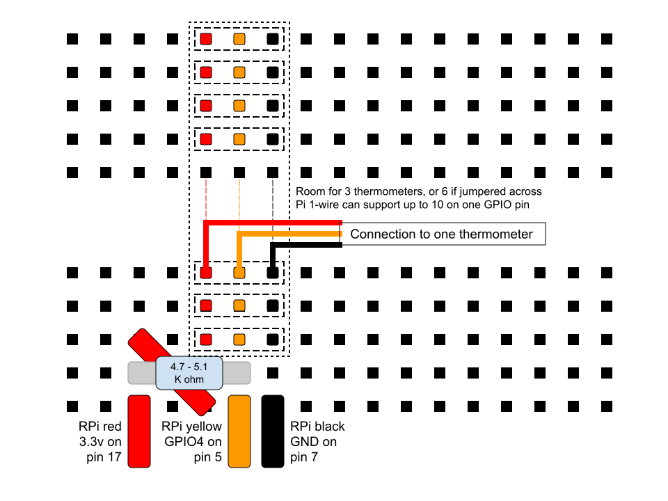

# https://github.com/cjbnc/rpi_thermometers

using DS18B20 thermometers with your raspberry pi

## Hardware

This kit is using DS18B20 thermometers made into weatherproof probes.
There are many of them on Amazon, but I specifically purchased these.

* [Aideepen 5PCS DS18B20 Probe 3 Meter Cable](https://www.amazon.com/gp/product/B07RJMVY54/)

The probes should come with three exposed wires to connect to your
project. Those wires are:

* Red = Power (3.3v)
* Yellow = Data
* Black = Ground

Some Audrino projects run these probes at 5v, but the Pi GPIO data lines
should not be sent more than 3.3v

The circuit also requires a pull-up resistor of about 5k ohm resistance
to connect the red and yellow lines. Either 4.7k or 5.1k seems to work
just fine.

### Pi Connections

* The power (red) wires need to attach to 3.3v, on pin 1 or pin 17.
* The ground (black) wires can attach to any ground, pins 6, 9, 14,
  20, etc...
* The data (yellow) wires can connect to any GPIO pin, but GPIO4 is the
  default for the one-wire network used by these probes. GPIO4 = pin 7.

In practice, on my Pi 4, I have a case fan that uses pins 1 and 6 for the
fan. I am using pins 7 (GPIO4), 9 (GND), and 17 (3.3v) to connect to my
thermometers

Note: the one-wire network can support up to 10 probes as long as the
total network length doesn't get too long. I am using two of the 
3-meter probes wired in parallel to the same three pins with no problems.

### Breadboard Wiring



This diagram uses a fourth row to allow for the space needed for the 
pull-up resistor. You may just connect it between the red and yellow 
rows directly, if you prefer.

* Pick three rows for the probes wires - red, yellow and black.
  Attach the wires of one probe to these rows.
* Connect a jumper from the RPi pin 7 (GND) to the black row.
* Connect a jumper from the RPi pin 5 (GPIO4) to the yellow row.
* Pick another row nearby and connect the resistor between this 
  new row and the yellow row.
* Connect a jumper from the RPi pin 17 (3.3v) to the fourth row.
* Connect a short jumper from the fourth row to the red row.

To add additional probes later, just connect them to the existing 
red, yellow, and black rows. 

Double-check your pin selections before turning on the Pi!

## Software

### Enable one-wire drivers in the Raspbian kernel

From the command line:

```
sudo vi /boot/config.txt
    # go down to the bottom in the [all] section
    # add this line
    dtoverlay=w1-gpio
    # if you used another GPIO than GPIO4, I think you can specify it here.
    # ask Google!
sudo reboot
```

Or, from the desktop, open:
* Menu > Preferences > Raspberry Pi Configuration
* Interfaces Tab > 1-Wire > Enable
* and reboot

After reboot, start the kernel modules and see if the probe is responding.

```
sudo modprobe w1-gpio
sudo modprobe w1-therm
cd /sys/bus/w1/devices/
ls
    28-011921372d21  w1_bus_master1
```

If things are working, you should see a directory here for each probe. The 
name will be `28-(probe_id_hex)`. The probe ID appears to be set by each
probe and does not change for that device. 

Now get a reading:

```
cd 28-011921372d21
cat w1_slave
    5d 01 4b 46 7f ff 0c 10 94 : crc=94 YES
    5d 01 4b 46 7f ff 0c 10 94 t=21812
# that's 21.812 C = 71.26 F
```

The t-value is returned in milli-degrees C. Divide by 1000 to get deg C. Then convert
to F with `F = 9/5 * C + 32`.

Hold the probe in your hand for a few seconds, and take another reading.
The temperature should go up.

```
cat w1_slave
    5d 01 4b 46 7f ff 0c 10 94 : crc=94 YES
    5d 01 4b 46 7f ff 0c 10 94 t=26187
# that's 26.187 C = 79.13 F
```

Note: The driver software is hard-coded to use 750ms to take a reading. 
You'll probably notice this with a slight delay getting the `cat`
results back from the device. If you are taking one reading/probe every
30 seconds or so, you have plenty of time.

You now have all you need to write a polling program in your
favorite language. The python code that I adapted in this repo just
reads those device files every 30 seconds and parses the t-value out
of the response.

### Resolution and Accuracy

The probes can return data with a resolution of 9, 10, 11, or 12 bits.
They should be set to 12 bits by default at the factory. The values that 
are returned should be in steps of:

* 1/16th of a degree C, or 0.0625 degrees
* which is nearly 1/9th of a degree F, or 0.1125 degrees

I tested two of my probes by leaving them running side-by-side
overnight. They both stayed at a nearly constant 1-2 steps different as
the temperature changed in my house. They are accurate to each other by
less 0.25 deg F difference.

If your probes are returning data in bigger steps than those listed
above, there's a program floating around that you can run to check the
bit-settting on the probe. This copy worked for me on my Pi 4.

```
git clone https://github.com/danjperron/BitBangingDS18B20
cd BitBangingDS18B20/
gcc -lrt -o configDS18B20 configDS18B20.c
sudo ./configDS18B20
    GPIO 4
    BCM GPIO BASE= 0
    ...50 01 4B 46 7F FF 0C 10 E8
    12 bits  Temperature:  21.00 +/- 0.062500 Celsius
    DS18B20 Resolution (9,10,11 or 12) ?
    (ctrl-c since I don't want to change that from 12 bits)
```

### thermo.py - Polling Script

This is a version of the script that I run on my Pi. It can handle 
multiple probes with labels. Here's the help info:

```
usage: thermo.py [-h] [-l LOGFILE] [-q] [-r RAMFILE] [-s SLEEP]

Record readings from DS18B20 thermometer

optional arguments:
  -h, --help            show this help message and exit
  -l LOGFILE, --logfile LOGFILE
                        specify log file to record readings
  -q, --quiet           silence reports to stdout (use with -l)
  -r RAMFILE, --ramfile RAMFILE
                        store latest results in file on ramdrive
  -s SLEEP, --sleep SLEEP
                        time to sleep between readings
```

Why `ramfile`? The Pi runs on an SD card. It seemed like a bad idea to
write the same short file over and over to the card. The Pi OS
automatically creates a user ram disk usually at `/run/user/1000` so I
decided to put my latest-reading file there. You could also put the
running log file there if you wanted, but then you'll lose your log on
any reboot.

Before you use this program, you will need to edit it to add your 
probe IDs to the `devs` list. 

```
cp thermo.py /home/pi/bin/thermo.py
vi /home/pi/bin/thermo.py
    # CHANGE THESE TO YOUR DEVICES AND LABELS
    devs = (
        {'dev':'28-011921372d21', 'loc':'hm_office'},
        {'dev':'28-0119213fa93a', 'loc':'hm_outside'},
    )
```

If you try to run the program and you get the `No matching devices found` 
error, you probably have the wrong devices listed.

#### Example usage:

```
bin/thermo.py -s 10 -l /run/user/1000/temps.csv -r /run/user/1000/latest.txt
['2020-01-03 21:06:40', 'hm_office', '20.69', '69.24', 'hm_outside', '12.44', '54.39']
['2020-01-03 21:06:52', 'hm_office', '20.69', '69.24', 'hm_outside', '12.44', '54.39']
^CStopping on Ctrl-C

# logfile has all the data
cat /run/user/1000/temps.csv
2020-01-03 21:06:40,hm_office,20.69,69.24,hm_outside,12.44,54.39
2020-01-03 21:06:52,hm_office,20.69,69.24,hm_outside,12.44,54.39

# ramfile has just the last reading
cat /run/user/1000/latest.txt
2020-01-03 21:06:52, hm_office, 20.69, 69.24, hm_outside, 12.44, 54.39
```

Console output is a dump of the results list, starting with a timestamp
for the reading. Then for each device, it adds the `loc` label and the
reading in degC and DegF. The logfile uses the same results, minus the
python `[]` array brackets, so it's a usable CSV format.

Note: In this example, I requested a `-s 10` sleep value of 10 seconds.
You can see the results were reported about 12 seconds apart. Remember
the probes take at least 750ms to read, so two probes will read about
every 12 seconds. The default sleep is 28 seconds, giving a 30 second 
actual interval. 

#### Run as a service

`mythermo.service` is a basic systemd unit file that you can use to 
keep the program running as a service. To install and start it:

```
vi mythermo.service
    # make any changes to the options on the ExecStart line

sudo cp mythermo.service /etc/systemd/system
sudo systemctl daemon-reload
sudo systemctl start mythermo
sudo systemctl enable mythermo
sudo systemctl status mythermo
    # to confirm the process is running
cat /run/user/1000/latest.txt
    # should see the most recent readings
    2020-01-03 21:25:53, hm_office, 21.19, 70.14, hm_outside, 12.44, 54.39
```
