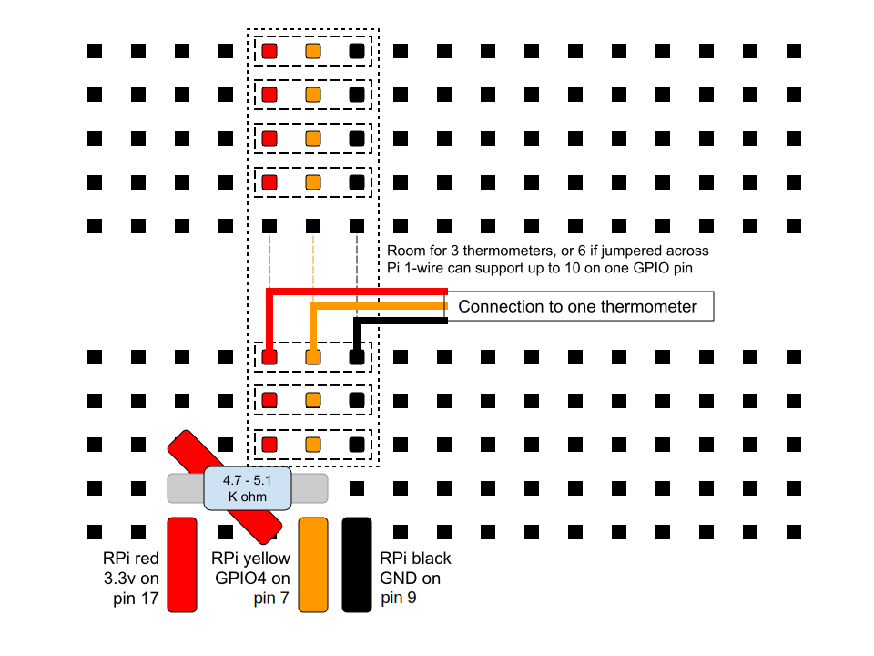

# rpi_thermometers
using DS18B20 thermometers with your raspberry pi

## Hardware

This kit is using DS18B20 thermometers made into weatherproof probes.
There are many of them on Amazon, but I specifically purchased these.

* [Aideepen 5PCS DS18B20 Probe 3 Meter Cable](https://www.amazon.com/gp/product/B07RJMVY54/)

The probes should come with three exposed wires to connect to your
project. Those wires are:

* Red = Power (3.3v)
* Yellow = Data
* Black = Ground

Some Audrino projects run these probes at 5v, but the Pi GPIO data lines
should not be sent more than 3.3v

The circuit also requires a pull-up resistor of about 5k ohm resistance
to connect the red and yellow lines. Either 4.7k or 5.1k seems to work
just fine.

## Pi Connections

* The power (red) wires need to attach to 3.3v, on pin 1 or pin 17.
* The ground (black) wires can attach to any ground, pins 6, 9, 14,
  20, etc...
* The data (yellow) wires can connect to any GPIO pin, but GPIO4 is the
  default for the one-wire network used by these probes. GPIO4 = pin 7.

In practice, on my Pi 4, I have a case fan that uses pins 1, 6 for the
fan. I am using pins 7 (GPIO4), 9 (GND), and 17 (3.3v) to connect my
thermometers

Note: the one-wire network can support up to 10 probes as long as the
total network length doesn't get too long. I am using two of the 3M
probes wired in parallel to the same three pins with no problems.

## Breadboard Wiring

This diagram uses a fourth row to allow for the space needed for the 
pull-up resistor. You may just connect it between the red and yellow 
rows directly, if you prefer.

* Pick three rows for the probes wires - red, yellow and black.
  Attach the wires of one probe to these rows.
* Connect a jumper from the RPi pin 7 (GND) to the black row.
* Connect a jumper from the RPi pin 5 (GPIO4) to the yellow row.
* Pick another row nearby and connect the resistor between this 
  new row and the yellow row.
* Connect a jumper from the RPi pin 17 (3.3v) to the fourth row.
* Connect a short jumper from the fourth row to the red row.

To add additional probes later, just connect them to the existing 
red, yellow, and black rows. 
